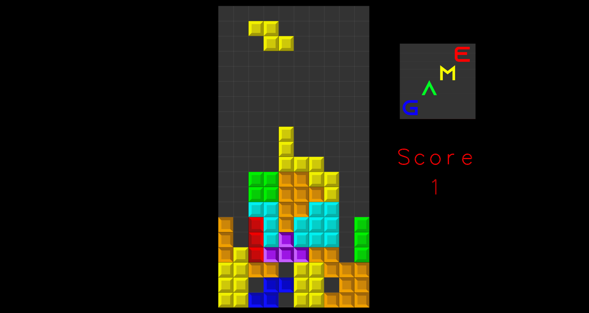
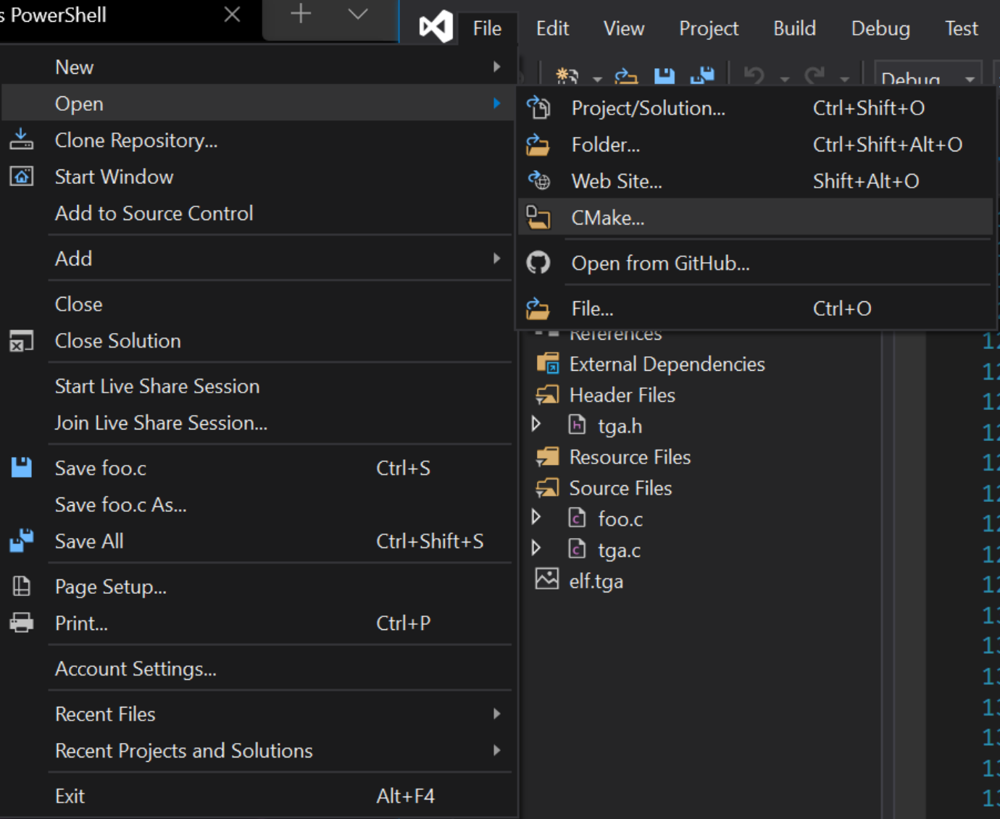
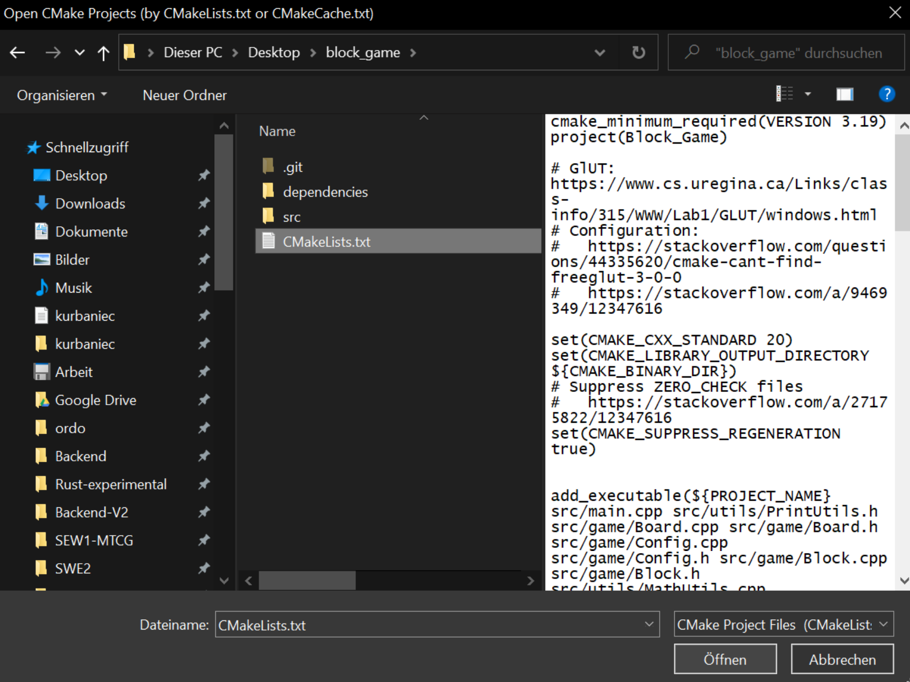
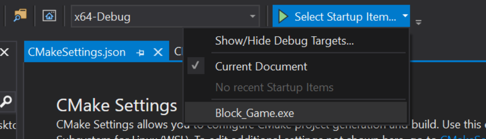

<h1 align="center">
  <br>
    
  <br>
  Block Game 🕹️
  <br>
</h1>

<h4 align="center">Simple puzzle game based on OpenGL</h4>

## 🛠️ Build

Building the game using Visual Studio with CMake and the MSVC toolchain under Windows:

`File > Open > CMake`



Select `CMakeCache.txt`



Select the correct target `Block_Game.exe`



## :package: Dependencies 

* `FreeGLUT`

  OpenGL Utility Toolkit library for window management & more.

* `irrKlang`

  Free sound library for non-commercial use.

All dependencies (suitable for use under Windows) are found in the `dependencies` folder. One does not need to configure system paths or anything else in order to use them, CMake does all the heavy lifting for you.

## :sparkles: Features

Game controls:

* `Arrow Key Left` & `Right` - Move Game Block :arrow_left: & :arrow_right: 
* `Arrow Key Down` - Drop Game Block :arrow_down: 
* `Space` - Rotate Game Block
* `P` - Pause Game

## :heavy_check_mark: Team members & responsibility

* Kacper Urbaniec
  * Project Setup
  * Game Logic (Movement, Transformations, Collision Detection, Line Clear & Game Over Check)
  * Handling Game Input
  * (Simple, Untextured) Drawing of Game Pieces & Board

* Julian Brzakala (If20b187)
  * Texture Loading & Binding
  * Different Textures on Logo Quad
  * Selfmade Textures created in Adobe Illustrator
  * Gameover Screen

* Mohamed Elshal (If20b237)
  * Texture Loader(Small Changes on TGA Loader)
  * Quad for Logo
  * Animation (LogoQuad)
  * Lightning (LogoQuad)
  * Material (LogoQuad)
  * Text (for Score)
  * Audio

## :book: Documentation

Checkout the `git` history!

```
git log
```

## :thinking: Problems while Building

* `cmake_minimum_required`

  Check if your running the latest CMake version. You can also specify it explicitly under `Manage Configuration > Advanced > CMake executable`. A typical path is `C:\Program Files (x86)\Microsoft Visual Studio\2019\BuildTools\Common7\IDE\CommonExtensions\Microsoft\CMake\CMake\bin`.

## :books: Sources

* [Learning Modern JavaScript with Tetris - Michael Karén](https://michael-karen.medium.com/learning-modern-javascript-with-tetris-92d532bcd057)
* [Learn OpenGL - Joey de Vries](https://learnopengl.com/)
* [irrKlang Libary](https://www.ambiera.at/downloads/irrKlang-64bit-1.6.0.zip)
